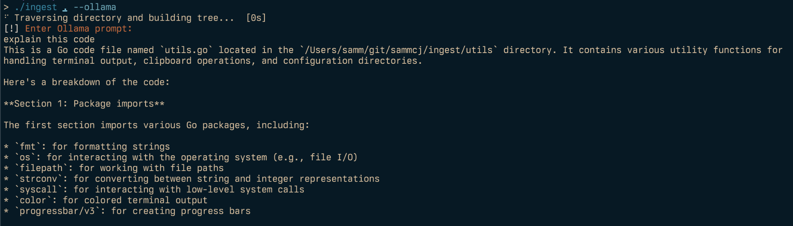

# Ingest

Ingest is a command-line tool designed to parse directories of plain text files, such as source code, into a single markdown file.

It's intended use case is for preparing content to be provided to AI/LLMs.


## Features

- Traverse directory structures and generate a tree view
- Include/exclude files based on glob patterns
- Parse output directly to Ollama for processing
- Generate and include git diffs and logs
- Count approximate tokens for LLM compatibility
- Customisable output templates
- Copy output to clipboard (when available)
- Export to file or print to console
- Optional JSON output

## Installation

### go install (recommended)

Make sure you have Go installed on your system, then run:

```shell
go install github.com/sammcj/ingest@HEAD
```

### Manual install

1. Download the latest release from the [releases page](https://github.com/sammcj/ingest/releases)
2. Move the binary to a directory in your PATH, e.g. `mv ingest* /usr/local/bin/ingest`

## Usage

Basic usage:

```shell
ingest [flags] <paths>
```

ingest will default the current working directory, if no path is provided, e.g:

```shell
$ ingest

⠋ Traversing directory and building tree...  [0s] [i] 9741 Tokens (Approximate)
[✓] Copied to clipboard successfully.
```

Generate a prompt from a directory, including only Python files:

```shell
ingest -i "**/*.py" /path/to/project
```

Generate a prompt with git diff and copy to clipboard:

```shell
ingest -d /path/to/project
```

Generate a prompt for multiple files/directories:

```shell
ingest /path/to/project /path/to/other/project
```

Generate a prompt and save to a file:

```shell
ingest -o output.md /path/to/project
```

## Ollama Integration

Ingest can pass the generated prompt to [Ollama](https://ollama.com) for processing.



```shell
ingest --ollama /path/to/project
```

By default this will ask you to enter a prompt:

```shell
./ingest utils.go --ollama
⠋ Traversing directory and building tree...  [0s]
[!] Enter Ollama prompt:
explain this code
This is Go code for a file named `utils.go`. It contains various utility functions for
handling terminal output, clipboard operations, and configuration directories.
...
```

## Configuration

Ingest uses a configuration file located at `~/.config/ingest/config.json`.

You can make Ollama processing run without prompting setting `"ollama_auto_run": true` in the config file.

The config file also contains:

- `ollama_model`: The model to use for processing the prompt, e.g. "llama3.1:8b-q5_k_m".
- `ollama_prompt_prefix`: An optional prefix to prepend to the prompt, e.g. "This is my application."
- `ollama_prompt_suffix`: An optional suffix to append to the prompt, e.g. "explain this code"

Ingest uses the following directories for user-specific configuration:

- `~/.config/ingest/patterns/exclude`: Add .glob files here to exclude additional patterns.
- `~/.config/ingest/patterns/templates`: Add custom .tmpl files here for different output formats.

These directories will be created automatically on first run, along with README files explaining their purpose.

### Flags

- `-i, --include`: Patterns to include (can be used multiple times)
- `-e, --exclude`: Patterns to exclude (can be used multiple times)
- `--include-priority`: Include files in case of conflict between include and exclude patterns
- `--exclude-from-tree`: Exclude files/folders from the source tree based on exclude patterns
- `--tokens`: Display the token count of the generated prompt
- `-c, --encoding`: Optional tokeniser to use for token count
- `-o, --output`: Optional output file path
- `--ollama`: Send the generated prompt to Ollama for processing
- `-d, --diff`: Include git diff
- `--git-diff-branch`: Generate git diff between two branches
- `--git-log-branch`: Retrieve git log between two branches
- `-l, --line-number`: Add line numbers to the source code
- `--no-codeblock`: Disable wrapping code inside markdown code blocks
- `--relative-paths`: Use relative paths instead of absolute paths
- `-n, --no-clipboard`: Disable copying to clipboard
- `-t, --template`: Path to a custom Handlebars template
- `--json`: Print output as JSON
- `--pattern-exclude`: Path to a specific .glob file for exclude patterns
- `--print-default-excludes`: Print the default exclude patterns
- `--print-default-template`: Print the default template
- `--report`: Print the largest parsed files
- `--verbose`: Print verbose output
- `-V, --version`: Print the version number (WIP - still trying to get this to work nicely)

### Excludes

You can get a list of the default excludes by parsing `--print-default-excludes` to ingest.
These are defined in [defaultExcludes.go](https://github.com/sammcj/ingest/blob/main/filesystem/defaultExcludes.go).

To override the default excludes, create a `default.glob` file in `~/.config/ingest/patterns/exclude` with the patterns you want to exclude.

### Templates

Templates are written in standard [go templating syntax](https://pkg.go.dev/text/template).

You can get a list of the default templates by parsing `--print-default-template` to ingest.
These are defined in [template.go](https://github.com/sammcj/ingest/blob/main/template/template.go).

To override the default templates, create a `default.tmpl` file in `~/.config/ingest/patterns/templates` with the template you want to use by default.

## Contributing

Contributions are welcome, Please feel free to submit a Pull Request.

## License

- Copyright 2024 Sam McLeod
- This project is licensed under the MIT License - see the [LICENSE](LICENSE) file for details.

## Acknowledgements

- Initially inspired by [mufeedvh/code2prompt](https://github.com/mufeedvh/code2prompt)
