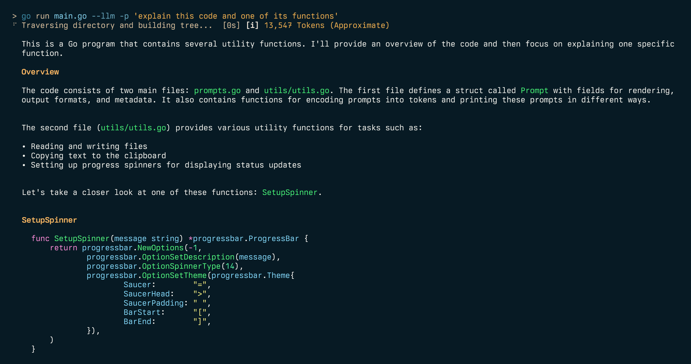

# Ingest


Ingest parses directories of plain text files, such as source code, into a single markdown file suitable for ingestion by AI/LLMs.

---


Ingest can also pass the prompt directly to an LLM such as Ollama for processing.



And ingest web URLs.


You can help sponsor the project by trading the $INGEST SOL Token: https://bags.fm/Dm98Qa1Xw2n35bq73R2t1bFgXPApUKu2YwzU8TjWBAGS

## Features

- Traverse directory structures and generate a tree view
- Include/exclude files based on glob patterns
- Compress code using Tree-sitter to extract key structural information while omitting implementation details
- Estimate vRAM requirements and check model compatibility using another package I've created called [quantest](https://github.com/sammcj/quantest)
- Parse output directly to LLMs such as Ollama or any OpenAI compatible API for processing
- Generate and include git diffs and logs
- Count tokens using offline tokeniser (default) or optionally use Anthropic API (API key required, but no charge for counting)
- Customisable output templates
- Copy output to clipboard (when available)
- Export to file or print to console
- Optional JSON output
- Optionally save output to a file in ~/ingest
- Shell completions for Bash, Zsh, and Fish
- Web crawling to ingest web pages as Markdown
- PDF to markdown conversion and ingestion

Ingest Intro ("Podcast" Episode):

<audio src="https://github.com/sammcj/smcleod_files/raw/refs/heads/master/audio/podcast-ep-sw/Podcast%20Episode%20-%20Ingest.mp3" controls preload></audio>

## Installation

### go install (recommended)

Make sure you have Go installed on your system, then run:

```shell
go install github.com/sammcj/ingest@HEAD
```

### curl

I don't recommend this method as it's not as easy to update, but you can use the following command:

```shell
curl -sL https://raw.githubusercontent.com/sammcj/ingest/refs/heads/main/scripts/install.sh | bash
```

### Manual install

1. Download the latest release from the [releases page](https://github.com/sammcj/ingest/releases)
2. Move the binary to a directory in your PATH, e.g. `mv ingest* /usr/local/bin/ingest`

## Usage

Basic usage:

```shell
ingest [flags] <paths>
```

ingest will default to the current working directory if no path is provided, e.g:

```shell
$ ingest

⠋ Traversing directory and building tree...  [0s]
[ℹ️] Tokens (Approximate): 15,945
[✅] Copied to clipboard successfully.
```

The first time ingest runs, it will download a small [tokeniser](https://github.com/pkoukk/tiktoken-go-loader/blob/main/assets/cl100k_base.tiktoken) called 'cl100k_base.tiktoken' this is used for tokenisation.

Generate a prompt from a directory, including only Python files:

```shell
ingest -i "**/*.py" /path/to/project
```

Generate a prompt with git diff and copy to clipboard:

```shell
ingest -d /path/to/project
```

Generate a prompt for multiple files/directories:

```shell
ingest /path/to/project /path/to/other/project
```

Generate a prompt and save to a file:

```shell
ingest -o output.md /path/to/project
```

You can also provide individual files or multiple paths:

```shell
ingest /path/to/file /path/to/directory
```

Save output to to ~/ingest/<directory_name>.md:

```shell
ingest --save /path/to/project
```

### VRAM Estimation and Model Compatibility

Ingest includes a feature to estimate VRAM requirements and check model compatibility using the [Gollama](https://github.com/sammcj/gollama)'s vramestimator package. This helps you determine if your generated content will fit within the specified model, VRAM, and quantisation constraints.

To use this feature, add the following flags to your ingest command:

```shell
ingest --vram --model <model_id> [--memory <memory_in_gb>] [--quant <quantisation>] [--context <context_length>] [--kvcache <kv_cache_quant>] [--quanttype <quant_type>] [other flags] <paths>
```

Examples:

Estimate VRAM usage for a specific context:

```shell
ingest --vram --model NousResearch/Hermes-2-Theta-Llama-3-8B --quant q4_k_m --context 2048 --kvcache q4_0 .
# Estimated VRAM usage: 5.35 GB
```

Calculate maximum context for a given memory constraint:

```shell
ingest --vram --model NousResearch/Hermes-2-Theta-Llama-3-8B --quant q4_k_m --memory 6 --kvcache q8_0 .
# Maximum context for 6.00 GB of memory: 5069
```

Find the best BPW (Bits Per Weight):

```shell
ingest --vram --model NousResearch/Hermes-2-Theta-Llama-3-8B --memory 6 --quanttype gguf .
# Best BPW for 6.00 GB of memory: IQ3_S
```

The tool also works for exl2 (ExllamaV2) models:

```shell
ingest --vram --model NousResearch/Hermes-2-Theta-Llama-3-8B --quant 5.0 --context 2048 --kvcache q4_0 . # For exl2 models
ingest --vram --model NousResearch/Hermes-2-Theta-Llama-3-8B --quant 5.0 --memory 6 --kvcache q8_0 . # For exl2 models
```

When using the VRAM estimation feature along with content generation, ingest will provide information about the generated content's compatibility with the specified constraints:

```shell
ingest --vram --model NousResearch/Hermes-2-Theta-Llama-3-8B --memory 8 --quant q4_0 .
⠋ Traversing directory and building tree... [0s]
[ℹ️] 14,702 Tokens (Approximate)
[ℹ️] Maximum context for 8.00 GB of memory: 10240
[✅] Generated content (14,702 tokens) fits within maximum context.
Top 15 largest files (by estimated token count):
1. /Users/samm/git/sammcj/ingest/main.go (4,682 tokens)
2. /Users/samm/git/sammcj/ingest/filesystem/filesystem.go (2,694 tokens)
3. /Users/samm/git/sammcj/ingest/README.md (1,895 tokens)
4. /Users/samm/git/sammcj/ingest/utils/utils.go (948 tokens)
5. /Users/samm/git/sammcj/ingest/config/config.go (884 tokens)
[✅] Copied to clipboard successfully.
```

Available flags for VRAM estimation:

- `--vram`: Enable VRAM estimation and model compatibility check
- `--model`: Specify the model ID to check against (required for estimation)
- `--memory`: Specify the available memory in GB for context calculation (optional)
- `--quant`: Specify the quantisation type (e.g., q4_k_m) or bits per weight (e.g., 5.0)
- `--context`: Specify the context length for VRAM estimation (optional)
- `--kvcache`: Specify the KV cache quantisation (fp16, q8_0, or q4_0)
- `--quanttype`: Specify the quantisation type (gguf or exl2)

Ingest will provide appropriate output based on the combination of flags used, such as estimating VRAM usage, calculating maximum context, or finding the best BPW. If the generated content fits within the specified constraints, you'll see a success message. Otherwise, you'll receive a warning that the content may not fit.

## LLM Integration

Ingest can pass the generated prompt to LLMs that have an OpenAI compatible API such as [Ollama](https://ollama.com) for processing.

```shell
ingest --llm /path/to/project
```

By default this will use any prompt suffix from your configuration file:

```shell
./ingest utils.go --llm
⠋ Traversing directory and building tree...  [0s]
This is Go code for a file named `utils.go`. It contains various utility functions for
handling terminal output, clipboard operations, and configuration directories.
...
```

You can provide a prompt suffix to append to the generated prompt:

```shell
ingest --llm -p "explain this code" /path/to/project
```

## Token Counting

Ingest provides token counting using either an offline tokeniser (default) or the Anthropic API for more accurate counts.

### Offline Token Counting (Default)

By default, ingest uses an offline tokeniser with a correction factor for improved accuracy:

```shell
ingest /path/to/project
# [ℹ️] Tokens (Approximate): 15,945
```

The offline tokeniser applies a 1.18x multiplier based on empirical analysis comparing it with Anthropic's API. This correction reduces average estimation error from ~17% to ~2%, providing slightly more accurate token counts without requiring an API key.

To disable the correction factor and use raw token counts, use the `--no-correction` flag:

```shell
ingest --no-correction /path/to/project
# Uses raw offline tokeniser without correction multiplier
```

The first time ingest runs, it downloads a small tokeniser file for offline use.

### Anthropic API Token Counting

For accurate token counts using Anthropic's counting API, use the `-a` or `--anthropic` flag:

```shell
export ANTHROPIC_API_KEY="your-api-key"
ingest -a /path/to/project
# ✓ Using Anthropic API (claude-sonnet-4-5) for token counting
# [ℹ️] Tokens (Approximate): 15,942
```

The API accepts keys from these environment variables (checked in order):
- `ANTHROPIC_API_KEY`
- `ANTHROPIC_TOKEN`
- `ANTHROPIC_TOKEN_COUNT_KEY`

**Performance optimisation**: When counting tokens for multiple files (e.g. in the "Top 15 largest files" report), ingest processes API requests in parallel batches of 4, significantly reducing the time needed for token counting.

If the API call fails, ingest automatically falls back to the offline tokeniser.

## Code Compression with Tree-sitter

**Experimental**

Ingest can compress source code files by extracting key structural information while omitting implementation details. This is useful for reducing token usage while preserving the important parts of the code structure.

```shell
ingest --compress /path/to/project
```

The compression extracts:
- Package/module declarations
- Import statements
- Function/method signatures (without bodies)
- Class definitions (without method bodies)
- Type definitions
- Comments

Currently supported languages:
- Go
- Python
- JavaScript (including arrow functions and ES6 module syntax)
- Bash
- C
- CSS

Example of compressed JavaScript:

```
// This is a JavaScript comment
import { something } from 'module';
export class MyJSClass { ... } // Body removed
constructor(name) { ... } // Body removed
greet(message) { ... } // Body removed
export function myJSFunction(x, y) { ... } // Body removed
const myArrowFunc = (a, b) => { ... } // Body removed
```

## Web Crawling & Ingestion

Crawl with explicit web mode

```shell
ingest --web https://example.com
```

Auto-detect URL and crawl

```shell
ingest https://example.com
```

Crawl with domain restriction

```shell
ingest --web --web-domains example.com https://example.com
```

Crawl deeper with more concurrency

```shell
ingest --web --web-depth 3 --web-concurrent 10 https://example.com
```

Exclude a path from the crawl

```shell
ingest --web https://example.com -e '/posts/**'
```

## Shell Completions

Ingest includes shell completions for Bash, Zsh, and Fish.

```shell
source <(ingest completion zsh)
```

See `ingest completion -h` for more information.

## Configuration

Ingest uses a configuration file located at `~/.config/ingest/ingest.json`.

You can make Ollama processing run without prompting setting `"llm_auto_run": true` in the config file.

The config file also contains:

- `llm_model`: The model to use for processing the prompt, e.g. "llama3.1:8b-q5_k_m".
- `llm_prompt_prefix`: An optional prefix to prepend to the prompt, e.g. "This is my application."
- `llm_prompt_suffix`: An optional suffix to append to the prompt, e.g. "explain this code"

Ingest uses the following directories for user-specific configuration:

- `~/.config/ingest/patterns/exclude`: Add .glob files here to exclude additional patterns.
- `~/.config/ingest/patterns/templates`: Add custom .tmpl files here for different output formats.

These directories will be created automatically on first run, along with README files explaining their purpose.

### Flags

- `-a, --anthropic`: Use Anthropic API for token counting (requires API key in environment)
- `--compress`: Enable code compression using Tree-sitter to extract key structural information while omitting implementation details
- `--config`: Opens the config file in the default editor
- `--no-correction`: Disable offline tokeniser correction factor (use raw token count)
- `--context`: Specify the context length for VRAM estimation
- `--exclude-from-tree`: Exclude files/folders from the source tree based on exclude patterns
- `--git-diff-branch`: Generate git diff between two branches
- `--git-log-branch`: Retrieve git log between two branches
- `--include-priority`: Include files in case of conflict between include and exclude patterns
- `--json`: Print output as JSON
- `--kvcache`: Specify the KV cache quantisation
- `--llm`: Send the generated prompt to an OpenAI compatible LLM server (such as Ollama) for processing
- `--memory`: Specify the available memory in GB for context calculation
- `--model`: Specify the model ID for VRAM estimation
- `--no-codeblock`: Disable wrapping code inside markdown code blocks
- `--no-default-excludes`: Disable default exclude patterns
- `--pattern-exclude`: Path to a specific .glob file for exclude patterns
- `--print-default-excludes`: Print the default exclude patterns
- `--print-default-template`: Print the default template
- `--quant`: Specify the quantisation type or bits per weight
- `--quanttype`: Specify the quantisation type (gguf or exl2)
- `--relative-paths`: Use relative paths instead of absolute paths
- `--report`: Print the largest parsed files
- `--save`: Save output to ~/ingest/<directory_name>.md
- `--tokens`: Display the token count of the generated prompt
- `--verbose`: Print verbose output
- `--vram`: Estimate VRAM usage and check model compatibility
- `--web-concurrent`: Maximum concurrent requests for web crawling
- `--web-depth`: Maximum depth for web crawling
- `--web-domains`: Comma-separated list of domains to restrict web crawling
- `--web`: Crawl a web page
- `-c, --encoding`: Optional tokeniser to use for token count
- `-d, --diff`: Include git diff
- `-e, --exclude`: Patterns to exclude (can be used multiple times)
- `-i, --include`: Patterns to include (can be used multiple times)
- `-l, --line-number`: Add line numbers to the source code
- `-n, --no-clipboard`: Disable copying to clipboard
- `-o, --output`: Optional output file path
- `-p, --prompt`: Optional prompt suffix to append to the generated prompt
- `-t, --template`: Path to a custom Handlebars template
- `-V, --version`: Print the version number (WIP - still trying to get this to work nicely)

### Excludes

You can get a list of the default excludes by parsing `--print-default-excludes` to ingest.
These are defined in [defaultExcludes.go](https://github.com/sammcj/ingest/blob/main/filesystem/defaultExcludes.go).

To override the default excludes, create a `default.glob` file in `~/.config/ingest/patterns/exclude` with the patterns you want to exclude.

### Templates

Templates are written in standard [go templating syntax](https://pkg.go.dev/text/template).

You can get a list of the default templates by parsing `--print-default-template` to ingest.
These are defined in [template.go](https://github.com/sammcj/ingest/blob/main/template/template.go).

To override the default templates, create a `default.tmpl` file in `~/.config/ingest/patterns/templates` with the template you want to use by default.

## Contributing

Contributions are welcome, Please feel free to submit a Pull Request.

## License

- Copyright 2024 Sam McLeod
- This project is licensed under the MIT License - see the [LICENSE](LICENSE) file for details.

<script src="http://api.html5media.info/1.1.8/html5media.min.js"></script>
